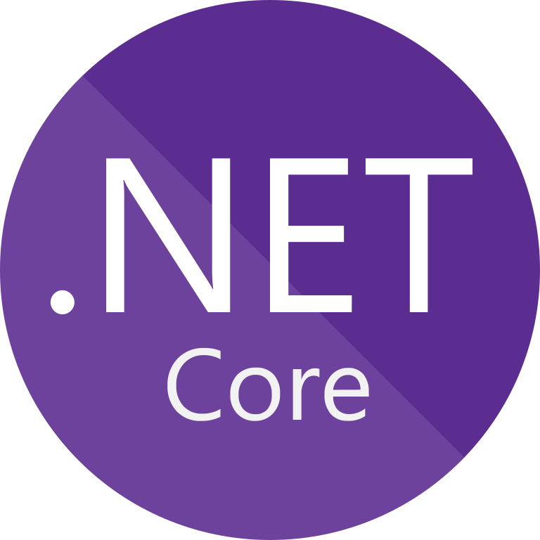
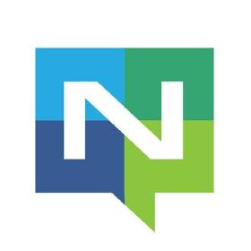

<!--  -->

<h2 align="center"> 
  Hola, I'm Bishwanath Dey Nayan.
   
  
   
  Thanks 💙 For Being A Valuable Visitor
   
   
  

  
  

</h2>

### I would like to introduce myself as a `Passoinate` and self taught 🎓 `Software Engineer` 💻 💻 💻 

I am a selt-taught motivated programmer, who loves coding very much. Always enjoys the opportunity to developo skills by **`adopting new technology`**. Love to **`share my small bits of knowledge`** with the people to acquire the big one.

 

## 🕸️ Connect with me on:

&nbsp; 
&nbsp; 
&nbsp; 
&nbsp; 

 

## 📓 Some info about me

* 🔭 I’m currently working in **S3 Innovate Pte. Ltd.**. 
* 🌱 I’m currently learning **Microservice Architecture and Exploring gRPC**.
* 👯 I’m looking to collaborate on any **.NET related Open Source Project**.
* 💬 Ask me about **C#, .NET, React**. I would be happy to share my knowledge.

 

## 🛠️ I'm Skilled At:

### Language
&nbsp; &nbsp; &nbsp; 
&nbsp; &nbsp; &nbsp; 
&nbsp; &nbsp; &nbsp;
 

### Framework
&nbsp; &nbsp; &nbsp; 
&nbsp; &nbsp; &nbsp; 
&nbsp; &nbsp; &nbsp; 
 

### Database
&nbsp; &nbsp; &nbsp; 
&nbsp; &nbsp; &nbsp; 
&nbsp; &nbsp; &nbsp; 
&nbsp; &nbsp; &nbsp;
 

### Others
&nbsp; &nbsp; &nbsp;
&nbsp; &nbsp; &nbsp;
&nbsp; &nbsp; &nbsp; 
&nbsp; &nbsp; &nbsp;
&nbsp; &nbsp; &nbsp;

&nbsp; &nbsp; &nbsp; 
&nbsp; &nbsp; &nbsp; 
&nbsp; &nbsp; &nbsp;  
 

## 💼 Platforms/Tools I've Used:

&nbsp; &nbsp; &nbsp; 
&nbsp; &nbsp; &nbsp; 
&nbsp; &nbsp; &nbsp; 
&nbsp; &nbsp; &nbsp; 
&nbsp; &nbsp; &nbsp; 
&nbsp; &nbsp; &nbsp;  

 

## 📊 My Dev Stats:

  &nbsp;&nbsp;
  
  

 

## 🎖️ Credits

Special thanks to <a href="https://github.com/showrin">Showrin Barua</a> as I have created this GitHub profile inspired by him.
 
 

## Stay safe!!!  ❤️ ❤️ ❤️

